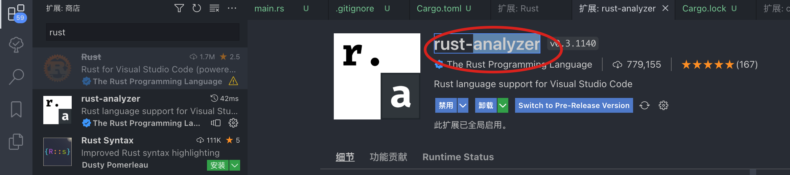
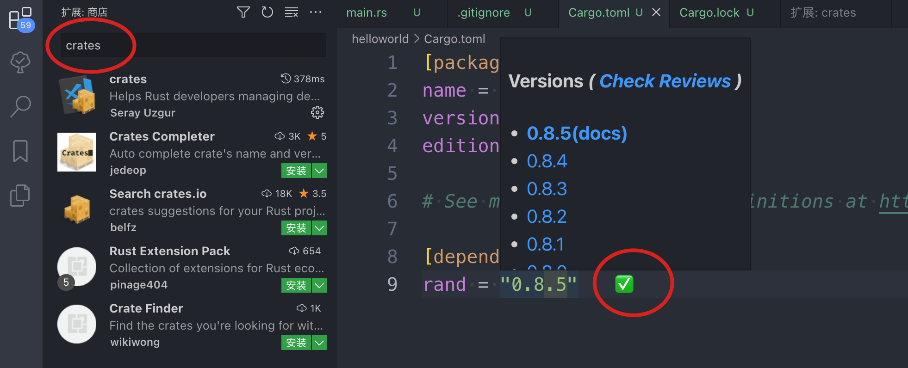
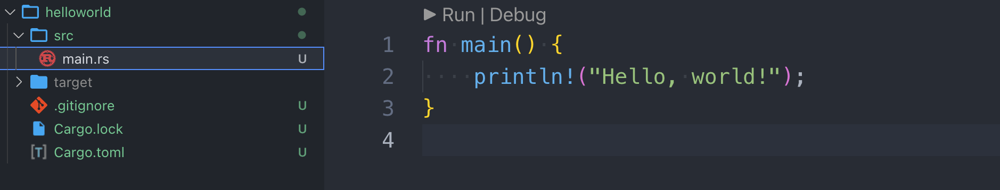
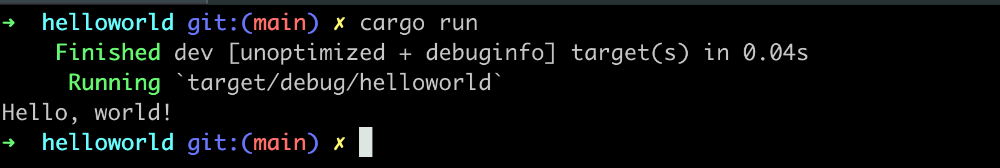
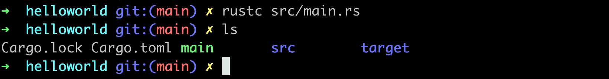
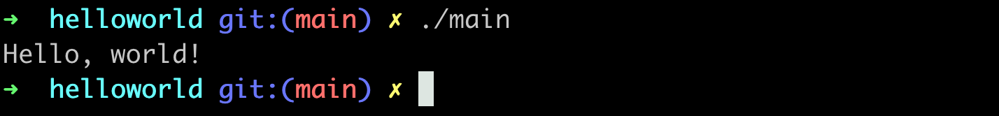

# 1.helloworld

## 安装Rust

```sh
$ curl --proto '=https' --tlsv1.2 https://sh.rustup.rs -sSf | sh
```

所有内容都在这里： ~/.cargo/bin

```sh
➜  helloworld git:(main) ✗ ls ~/.cargo/bin
cargo         cargo-expand  cargo-miri    rls           rust-gdbgui   rustc         rustfmt
cargo-clippy  cargo-fmt     clippy-driver rust-gdb      rust-lldb     rustdoc       rustup
```

## 工具链介绍

- rustc：编译器
- rustup：升级工具
  - rustup doc查看文档
- cargo：包管理工具

## 安装vscode插件

- rust-analyzer：最重要的rust解析插件



- crates：用于展示插件的子版本，从而进行灵活选择



## HelloWorld

创建工程：

```sh
cargo new helloworld
```

此时会自动创建工程结构，目录结构展示如下：



其中：

- main.rs是源文件
- Cargo.toml是配置文件，进行包管理工作，我们手动增加了一个rand包：rand = "0.8.5"

```js
[package]
name = "helloworld"
version = "0.1.0"
edition = "2021"

# See more keys and their definitions at https://doc.rust-lang.org/cargo/reference/manifest.html

[dependencies]
rand = "0.8.5"  // <== 手动增加的
```

## 编译&运行

回到src同级目录，执行命令进行编译：

```sh
cargo build
```

运行：

```sh
cargo run
```

此时仅执行文件，但是不会编译出二进制文件：



## 生成bin

编译：

```sh
rustc src/main.rs
```



执行：./main



## 其他

拓展待研究

```sh
rust toolchain list
```

