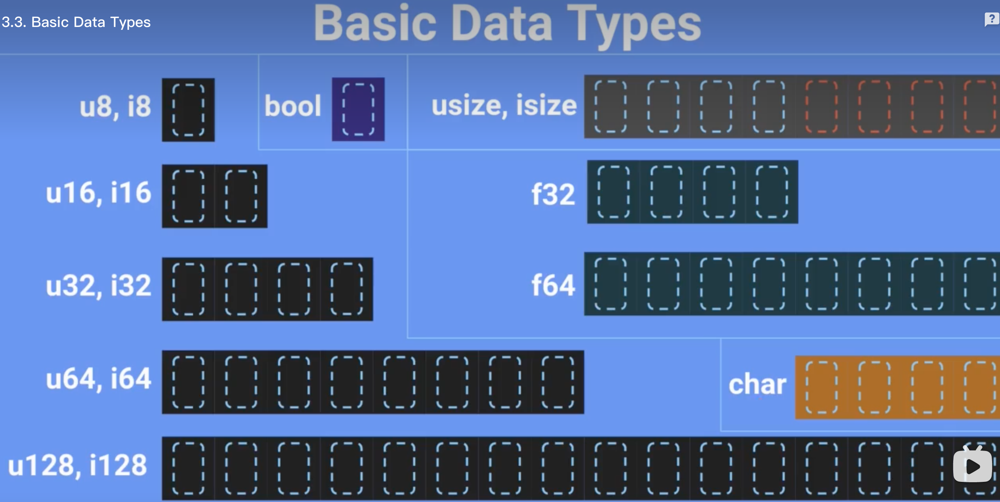
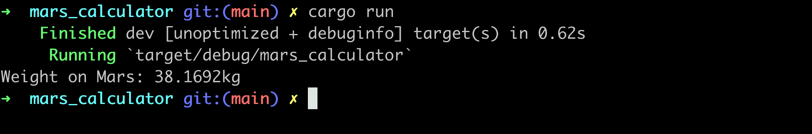
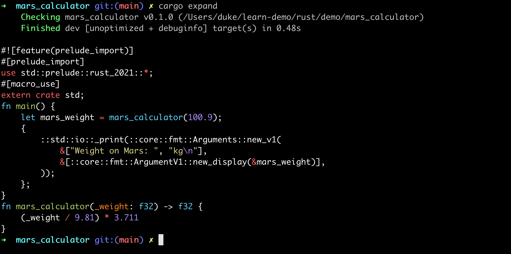

# 2.calculator


# 计算器Calculator

## 数据类型：

- u8:1字节
- char：4字节
- usize：8字节




## 创建工程

```sh
cargo new mars_calculator
```

编写main.rs如下：

```rust
fn main() {
    // 明确类型(不建议这样做)
    // let mars_weight: f32 = mars_calculator(100.9);

    // 自动推导返回类型(推荐方式)
    let mars_weight = mars_calculator(100.9);
    println!("Weight on Mars: {}kg", mars_weight);
}

fn mars_calculator(_weight: f32) -> f32 {
    (_weight / 9.81) * 3.711
}
```

运行：



## 安装expand

println是一个宏（Macro）定义，可以将它的代码展开

```sh
cargo install cargo-expand
```

运行：

```s
cargo expand
```



## 默认immutable

1. 所有的变量在rust中，默认都是immutable的，即定义之后不能修改
2. 如果想修改需要使用关键字mut（如果不加mut会报错）

```rust
fn main() {
    // let mars_weight = mars_calculator(100.9); // error
    let mut mars_weight = mars_calculator(100.9);
  
    mars_weight = mars_weight * 1000.0;

    println!("Weight on Mars: {}kg", mars_weight);
}

fn mars_calculator(_weight: f32) -> f32 {
    (_weight / 9.81) * 3.711
}
```

## 命令行输入

```rust
use std::io;

fn main() {
    println!("Enter a weight:(kg)");
  
  	// 1. 创建一个string类型
    let mut input = String::new();
  
  	// 2. 读取数据，写入到input中，这里的&表示传递引用，即直接修改input的值，而不是副本拷贝
  	// 3. unwrap是对返回值Result<T, Error>的处理，逻辑为：
  	// a. 如果执行成功，则正常返回
  	// b. 如果执行失败，则程序终止
    io::stdin().read_line(&mut input).unwrap();

  	// 4. 此处对输入（字符串）进行去除空格处理，并且自动转换成目标数据类型（f32)
    let weight: f32 = input.trim().parse().unwrap();
    println!("weight: {}", weight);
  
  	// 5. 此处为debug打印输出，目的是查看weight的数据类型，会发现是字符串，如："123"
    dbg!(weight);

    println!("input: {}", input);
    // let mars_weight = mars_calculator(100.9); // error
    let mut mars_weight = mars_calculator(weight);
    mars_weight = mars_weight * 1000.0;

    println!("Weight on Mars: {}kg", mars_weight);
}

fn mars_calculator(_weight: f32) -> f32 {
    (_weight / 9.81) * 3.711
}
```

## 测试

```sh
cargo run
```

## 其他

支持gdb调试，与C++几乎完全一致
